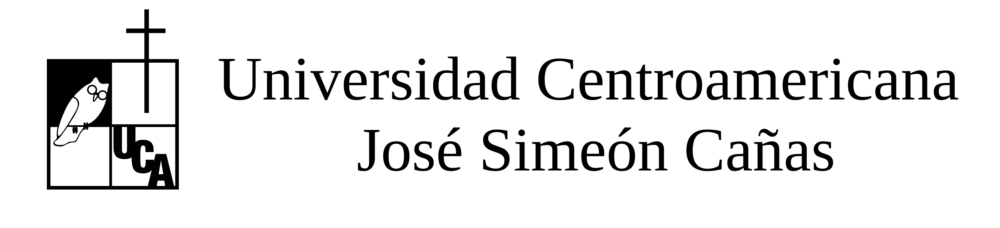
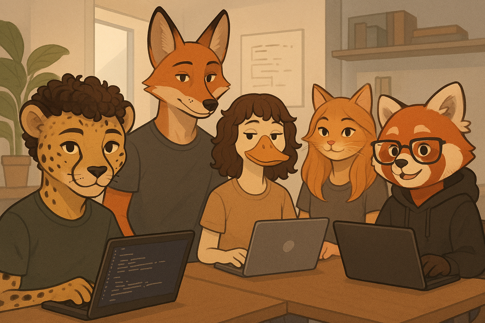

<h1 align="center">AMGEMS - Repositorio de Ejercicios en Prolog</h1>

  <strong>Universidad Centroamericana "José Simeón Cañas" (UCA)</strong> 
  <em>Facultad de Ingeniería y Arquitectura · Departamento de Informática y Electónica</em>

---

## Descripción General

Este repositorio, titulado **AMGEMS-Prolog**, reúne los **ejercicios, prácticas y actividades** desarrolladas durante el curso de **Programación declarativa**, utilizando el lenguaje **Prolog**.  

Su propósito es servir como un espacio colaborativo donde el equipo trabaja de forma organizada, comparte soluciones y documenta el aprendizaje adquirido en el manejo de la **programación lógica y declarativa**.

---

## Objetivos del Repositorio

- Consolidar los conocimientos adquiridos en **Prolog** mediante ejercicios prácticos.  
- Desarrollar la capacidad de **razonamiento lógico y formal**.  
- Fomentar el **trabajo en equipo y la gestión colaborativa de código**.  
- Mantener una estructura limpia y documentada de cada práctica.  

---

## Herramientas Utilizadas

- 🧩 **SWI-Prolog** – Entorno de ejecución y desarrollo.  
- 💻 **Visual Studio Code** con extensión *Prolog Language Support*.  
- 🗂️ **Git & GitHub** – Control de versiones y colaboración.  
- 📝 **Markdown** – Documentación de cada práctica.  

---

## Integrantes del Equipo AMGEMS

| Nombre Completo | Carnet |
|------------------|--------|
| Oscar Armando Calderón Arguera | 00090822 |
| Juan Neftaly Castellanos Hernández | 00182222 |
| **Axel Jahir Alvarado Alegría** | **00216022** |
| Valeria Elizabeth Ortiz Romero | 00206022 |
| Diego Sebastián Jiménez Artiga | 00074720 |

---

## Equipo de Trabajo

  

